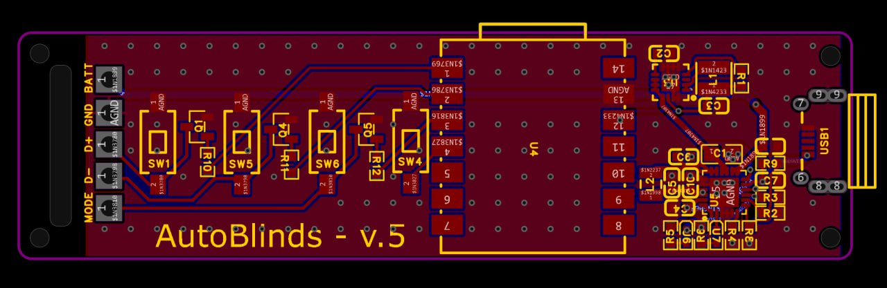
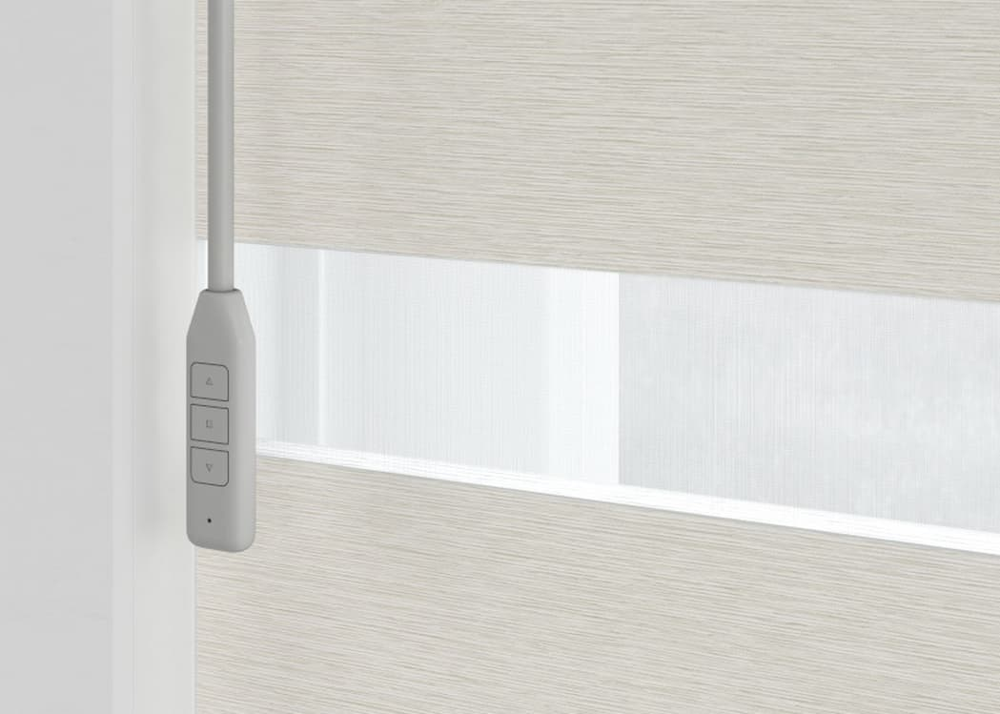
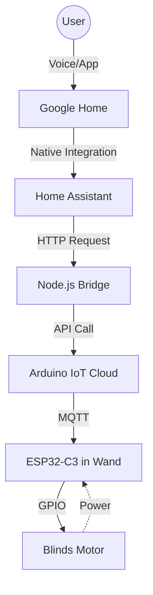
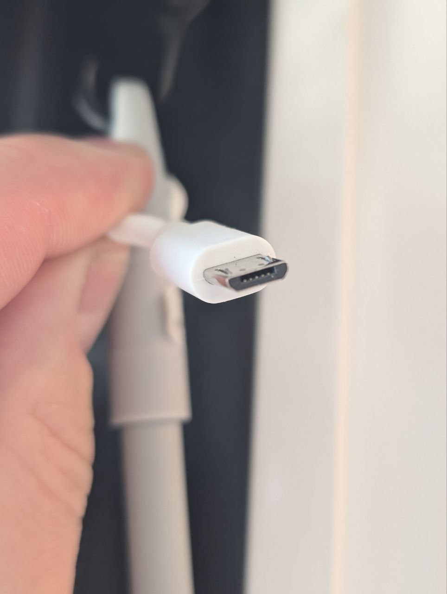
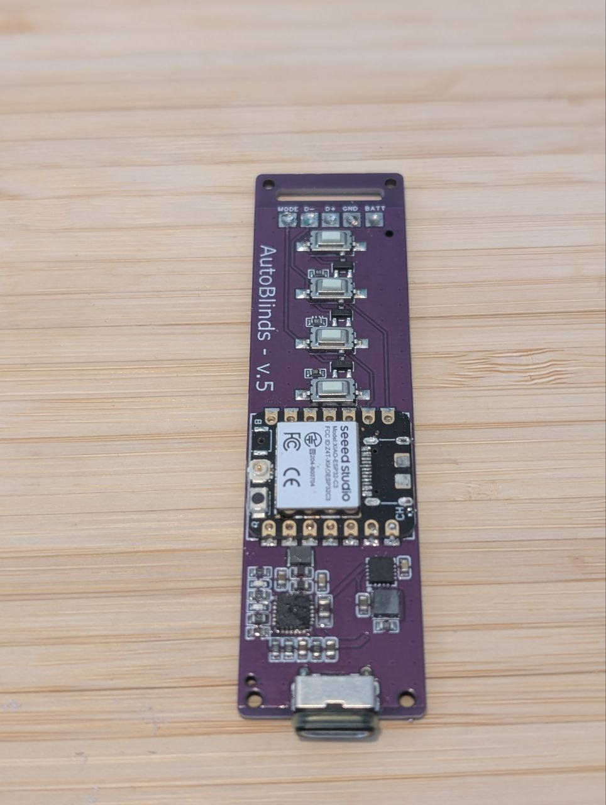
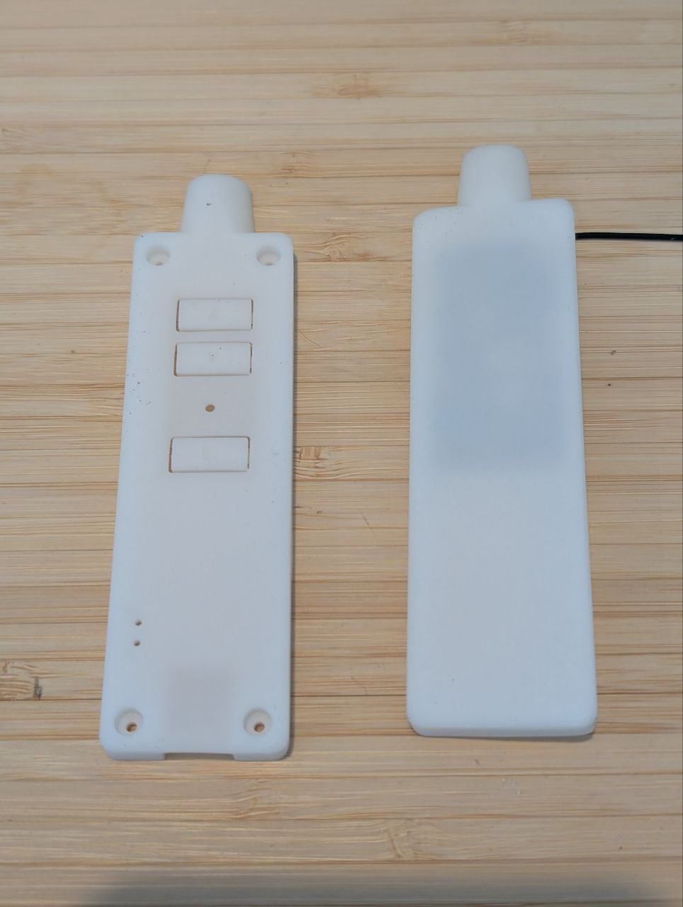
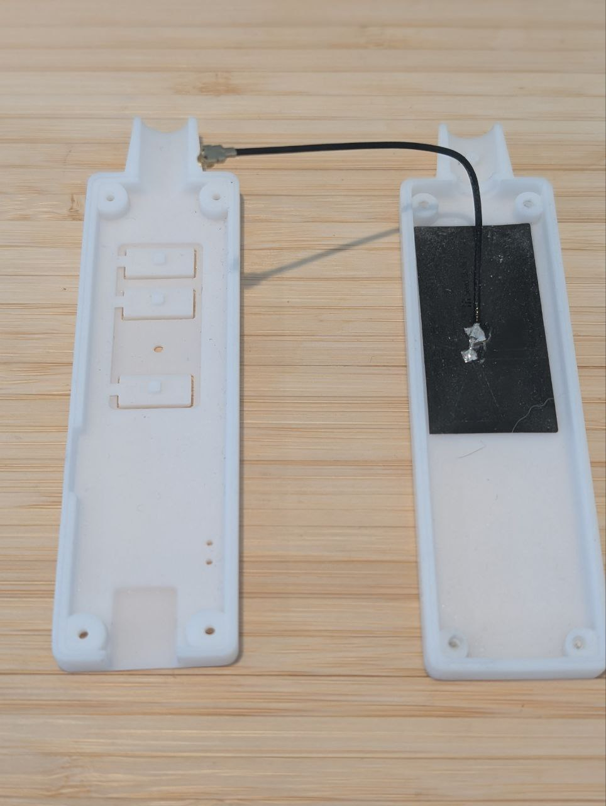
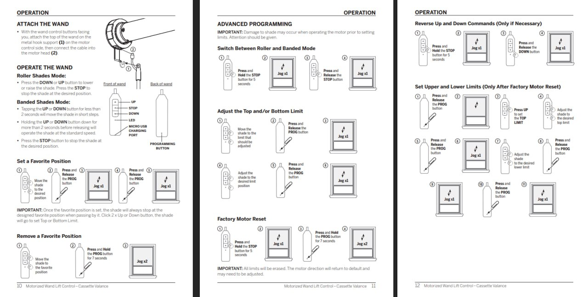

# Levolor Motorized Blind Smart Home Controller



## Who This is For
This solution is **confirmed to work** with **Levolor Motorized Blinds** equipped with the wired-in wand controller that interfaces via Micro-USB.

<p align="center">
  <br/><i>(Original Factory Wand Controller)</i>
</p>

**Broad Applicability:**
While specifically designed for Levolor, this architecture is likely compatible with any motorized blind system that uses a similar wand-based control. If your wand interfaces via a simple pin-shorting logic (even if the connector or pinout differs), this project can be adapted with minor firmware modifications to match your specific wiring.

## Overview
The Levolor Motorized Blind Smart Home Controller is a custom software and hardware solution designed to add smart home capabilities to "dumb" motorized blinds—specifically the **Levolor Wand Motorized Blinds**. 

After realizing the standard wands lacked native smart integration, this project was born to bridge that gap. It uses a custom **ESP32-C3 (Seeed Studio XIAO)** integrated directly into the wand controller, drawing power from the blinds' internal battery.
The wand interfaces via the existing Micro-USB port on the blinds, providing a non-destructive, "plug-and-play" installation.

While designed for blinds, the architecture is a generalized solution for controlling **any low-voltage DC home automation circuit** where power efficiency is critical.

## Features

- **Ultra-Low Power:** Optimized firmware achieving ~100µA idle current to preserve wand battery life.
- **Hardware Agnostic:** Can be adapted for various low-voltage DC applications.
- **Simple HTTP API:** Trigger device actions (Up/Down) via simple GET/POST requests.
- **Arduino Cloud Integration:** Authenticates automatically with `api2.arduino.cc` using client credentials.
- **Home Assistant Ready:** Designed to be exposed as native `cover` entities for high-quality Google Home integration.
- **Remote Logging:** Exposes an endpoint for devices to POST debug logs, which are stored and rotated locally.
- **Auth:** Simple token-based authentication for protecting the bridge.

### System Architecture



### Control Logic & Reverse Engineering
Through reverse engineering the original Levolor wand, it was discovered that the motor controller in the blind housing uses a standard Micro-USB interface for more than just charging. The wand communicates by shorting specific pins:

- **D+ / D- / Mode Pins:** Shorting these pins to ground (or each other) triggers the Up, Down, and Set functions.
- **The "Stop" Trick:** There is no dedicated stop pin. Sending a "Stop" command is achieved by shorting the **Up (D+)** and **Down (D-)** pins simultaneously.

### Hardware: Custom Wand Replacement
This project provides a complete **hardware replacement** for the original Levolor Wand housing. The custom-designed 3D-printed enclosure maintains the ergonomic form factor of the original wand while housing the smart internals and drawing power from the blinds' battery pack.
The wand interfaces via the existing Micro-USB port on the blinds, providing a non-destructive, "plug-and-play" installation.

<p align="center">
  
  
</p>

<p align="center">
  
  
  
</p>

**Key Technical Details:**
- **Current Draw:** ~100µA idle (optimized via Deep Sleep and power-efficient polling).
- **Circuitry:** Custom PCB using Seeed XIAO ESP32-C3, BQ25886 for battery management, and TPS62152 for efficient power regulation.
- **Versatility:** Although designed for these blinds, the bridge and firmware can control any low-voltage DC circuit.

### Advanced Programming & Calibration
The Levolor motor controller supports several advanced functions (like setting limits or switching modes) via the PROG/SET button and button combinations. These can be triggered through the bridge by sending the appropriate pin shorts.

<p align="center">
  
</p>

## Documentation

| Document | Description |
|----------|-------------|
| [`firmware/README.md`](firmware/README.md) | ESP32 firmware setup, pin mapping, flashing instructions |
| [`hardware/README.md`](hardware/README.md) | PCB design overview, schematics, manufacturing files |
| [`hardware/docs/BOM.md`](hardware/docs/BOM.md) | Bill of Materials with LCSC part numbers |
| [`hardware/case/README.md`](hardware/case/README.md) | 3D printable enclosure files and print settings |
| [`hardware/easyeda/README.md`](hardware/easyeda/README.md) | EasyEDA project files for PCB editing |
| [`home-assistant/README.md`](home-assistant/README.md) | Home Assistant integration for Google Home support |

## Setup

### Prerequisites

- **Node.js** v18 or later
- **npm** v9 or later
- **Arduino IoT Cloud** account with API credentials
- Assembled hardware (see [Hardware Documentation](hardware/README.md))
- ESP32 flashed with firmware (see [Firmware Documentation](firmware/README.md))

### 1. Arduino IoT Cloud Setup

Create a "Thing" in Arduino IoT Cloud with these properties:
- `up` (Boolean, Switch/Push): Triggers the blinds to open
- `down` (Boolean, Switch/Push): Triggers the blinds to close
- `debug_log` (String, Read-Only): Used by the ESP32 to report battery health and diagnostics

Then create an **API Key** under Arduino IoT Cloud → Integrations → API Keys.

### 2. Bridge Installation

```bash
git clone https://github.com/smb02dunnal/Levolor-Motorized-Blind-Smart-Home-Controller.git
cd Levolor-Motorized-Blind-Smart-Home-Controller/server
npm install
```

### 3. Configure Credentials

Create a `.env` file in the `server/` directory:

```env
PORT=8080

# Secure your bridge (recommended)
AUTH_TOKEN=your-secret-local-token

# Arduino IoT Cloud Credentials (from API Keys)
ARDUINO_CLIENT_ID=your-client-id
ARDUINO_CLIENT_SECRET=your-client-secret

# Optional Organization ID
# ARDUINO_ORG=
```

### 4. Map Your Devices

Copy the example config and edit with your Thing/Property IDs:

```bash
cp devices.config.json.example devices.config.json
```

```json
{
  "devices": {
    "office": {
      "thingId": "xxxxxxxx-xxxx-xxxx-xxxx-xxxxxxxxxxxx",
      "deviceId": "xxxxxxxx-xxxx-xxxx-xxxx-xxxxxxxxxxxx",
      "upPropertyId": "xxxxxxxx-xxxx-xxxx-xxxx-xxxxxxxxxxxx",
      "downPropertyId": "xxxxxxxx-xxxx-xxxx-xxxx-xxxxxxxxxxxx"
    }
  }
}
```

### 5. Run the Bridge

```bash
npm start
```

The bridge will start on `http://localhost:8080` (or your configured PORT).

For production, consider using a process manager like **pm2** or running as a **systemd** service.

## Usage

### Control a Device
```bash
# Open office blinds
curl "http://localhost:8080/set/office/up?token=your-secret-local-token"

# Close master bedroom blinds
curl "http://localhost:8080/set/master/down?token=your-secret-local-token"
```

### View Logs
```bash
# View last 200 lines of logs for 'office'
curl "http://localhost:8080/log/office?token=your-secret-local-token"
```

## Hardware

Custom PCB design using Seeed XIAO ESP32-C3 with battery charging (BQ25886) and power management (TPS62152). See the [Hardware Documentation](hardware/README.md) for schematics, Gerber files, and assembly instructions.

## Future Work

- **Further battery optimization** — Continue reducing idle current draw to maximize battery life
- **Smaller PCB form factor** — Shrink the board to fit within the original Levolor wand enclosure, requiring:
  - Double-sided PCB layout
  - Custom ESP32-C3 circuit (bare chip instead of Seeed XIAO module)

## License

ISC
