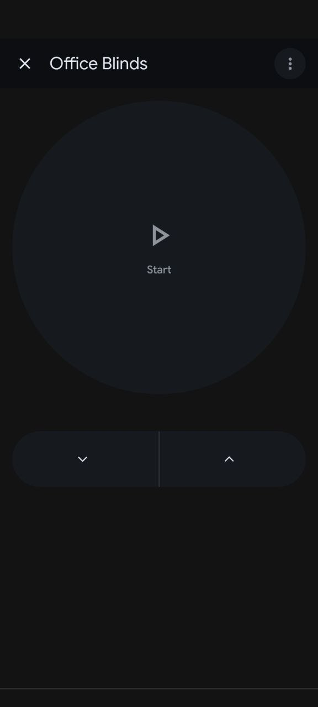

# Home Assistant Integration

Integrating the Arduino Bridge with Home Assistant allows you to expose your blinds as native `cover` entities. This is highly recommended for **Google Home/Assistant** users, as it ensures the devices are recognized as "Blinds" or "Shutters" rather than generic switches.

## Template Cover Configuration

Add the following to your Home Assistant `configuration.yaml` (or `covers.yaml`):

```yaml
cover:
  - platform: template
    covers:
      office_blinds:
        device_class: blind
        friendly_name: "Office Blinds"
        open_cover:
          service: shell_command.control_blinds
          data:
            device: "office"
            action: "up"
        close_cover:
          service: shell_command.control_blinds
          data:
            device: "office"
            action: "down"
```

## Shell Command Setup

To trigger the bridge, define the following `shell_command`:

```yaml
shell_command:
  control_blinds: 'curl "http://<bridge-ip>:8080/set/{{ device }}/{{ action }}?token=<your-token>"'
```

### Native Google Home UI
Using the Home Assistant `cover` component ensures Google Home displays the correct controls:

<p align="center">
  
</p>

## Benefits
- **Native UI:** Provides sliders and appropriate icons in Home Assistant.
- **Voice Control:** Allows commands like "Hey Google, open the office blinds" instead of "turn on."
- **Sync:** Ensures Google Home treats the device with the correct device class for a better user experience.

## Future Exploration
The project is currently at v0.5. While the current solution is fully functional, several areas for potential exploration include:
- **Advanced Power Management:** Further firmware optimizations to reduce the idle current draw below the current 100µA target.
- **Integrated ESP32 Design:** Moving away from the Seeed XIAO development board to a fully custom PCB with an onboard ESP32 module.
- **Footprint Reduction:** The ultimate design goal is to shrink the circuitry enough to fit entirely within the original Levolor wand housing, eliminating the need for a custom 3D-printed enclosure.
